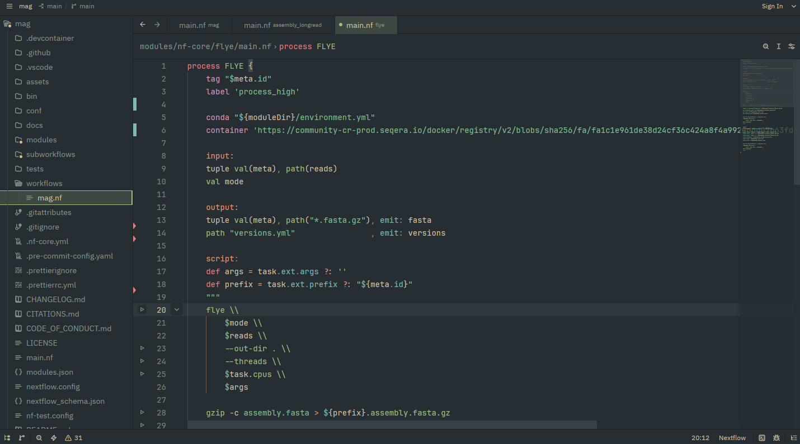

# nextflow-zed

Nextflow language support for [Zed](https://zed.dev/), using the official [Nextflow Tree-sitter grammar](https://github.com/nextflow-io/tree-sitter-nextflow) and [language server](https://github.com/nextflow-io/language-server).

Inspired by other works - see credits.



## Requirements

- Java 17 or later (to run the language server)
- [Rust](https://www.rust-lang.org/tools/install) when installing this as a dev extension

## Install

This extension is not yet published, but can be installed directly from the repository.

Clone it:

```bash
git clone https://github.com/Sam-Sims/nextflow-zed.git
```

Then in Zed:

1. Open the Extensions page.
2. Select `Install Dev Extension`.
3. Select the cloned `nextflow-zed` directory.

You can also open the command palette and run `zed: install dev extension`.

Zed will build and install the extension automatically. Open a `.nf` file to start it and the language server JAR will be downloaded on first use.

## Configuration

Configure the extension under the `lsp` key in your global Zed `settings.json`, or in a project's `.zed/settings.json`:

```json
{
  "lsp": {
    "nextflow-language-server": {
      "settings": {
        "nextflow": {
          "languageVersion": "26.04",
          "java": {
            "home": "/path/to/jdk-17-or-later"
          },
          "languageServer": {
            "path": "/absolute/path/to/language-server-all.jar"
          },
          "errorReportingMode": "warnings",
          "files": {
            "exclude": [".git", ".lineage", ".nf-test", ".pixi", ".venv", "work"]
          }
        }
      }
    }
  }
}
```

- The extension includes the following language server defaults from the [VS Code Nextflow extension configuration](https://github.com/nextflow-io/vscode-language-nextflow#configuration):
  - `nextflow.completion.extended`: `false`
  - `nextflow.completion.maxItems`: `100`
  - `nextflow.debug`: `false`
  - `nextflow.errorReportingMode`: `"warnings"`
  - `nextflow.files.exclude`: `.git`, `.lineage`, `.nf-test`, `.pixi`, `.venv` and `work`
  - `nextflow.formatting.harshilAlignment`: `false`
  - `nextflow.formatting.maheshForm`: `false`
  - `nextflow.formatting.sortDeclarations`: `false`
- However settings defined in the zed `settings.json` overwrite the extension defaults. See [Configuring Language Servers](https://zed.dev/docs/configuring-languages#configuring-language-servers) for details.
- The `java` and `languageServer` entries are optional overrides. Without them, the extension finds Java through `JAVA_HOME` or your `PATH` and automatically downloads the newest language server patch version for the selected Nextflow language version.
- Supported language versions are `26.04`, `25.10`, `25.04` and `24.10`. The default is `26.04`. Restart the language server after changing its version, Java installation or JAR.


## Credits

This extension builds on the work of several existing language extensions that provided useful references and inspiration:
- https://github.com/ctuni/zed-nextflow/tree/main/languages/nextflow
- https://github.com/DLBPointon/zed_nextflow
- https://github.com/valentinegb/zed-groovy/
- https://github.com/nextflow-io/tree-sitter-nextflow/tree/main/queries
- https://github.com/nextflow-io/vscode-language-nextflow
